# Premiers exercices sur Git et Visual Studio

## Objectif

L'objectif de ce module est de vous familiariser avec l'utilisation de Git et GitHub - "version de base".

## Pré-requis

- Avoir installé Git sur votre ordinateur
- Avoir configuré votre client Git sur la machine virtuelle et sur votre ordinateur
- Avoir installé Visual Studio sur votre ordinateur

## Exercice 1 - Accepter votre premier devoir distribué sur GitHub classroom

- Naviguez l'URL : [https://classroom.github.com/a/Kbu5Vc6N](https://classroom.github.com/a/Kbu5Vc6N)
- À votre première connexion, GitHub Classroom va vous demander l'autorisation d'accéder à votre compte GitHub : cliquez sur "Authorize GitHub Classroom". Si vous n'étiez pas authentifié, il faudra préalablement vous connecter à votre compte GitHub.

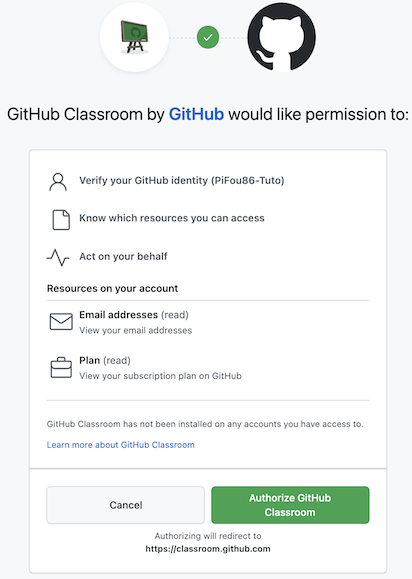

- Acceptez le premier travail en cliquant sur "Accept this assignment"

- Une fois accepté, GitHub Classroom va créer votre dépôt de travail qui est en réalité un dépôt GitHub (Cliquez sur le bouton rafraîchir du navigateur - encadré en rouge sur l'image).

- Une fois rafraîchie, la page affichera le lien vers votre dépôt

## Exercice 2 - Ouvrir le travail dans Visual Studio - Machine virtuelle

Cet exercice s'effectue à partir de votre machine virtuelle.

- Naviguez l'URL de votre dépôt de travail

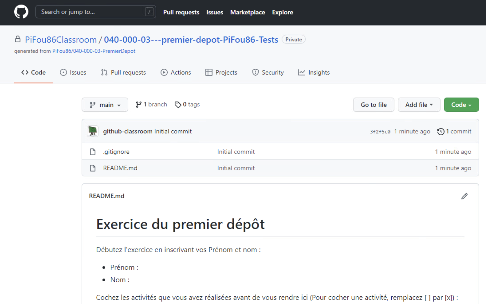

- Copiez le lien de votre dépôt : cliquez le bouton "Code" puis sur les deux carrés à côté du lien

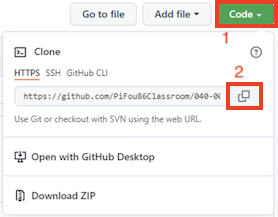

- Sur votre VM, lancez "Visual Studio 2022" en cliquant sur le bouton infini mauve/violet (pas le bleu !)

- Si Visual Studio vous demande de vous identifier, [suivez les instructions de ce lien](CONNEXTION_VS.md)
- Cliquez sur le "Clone un dépôt"

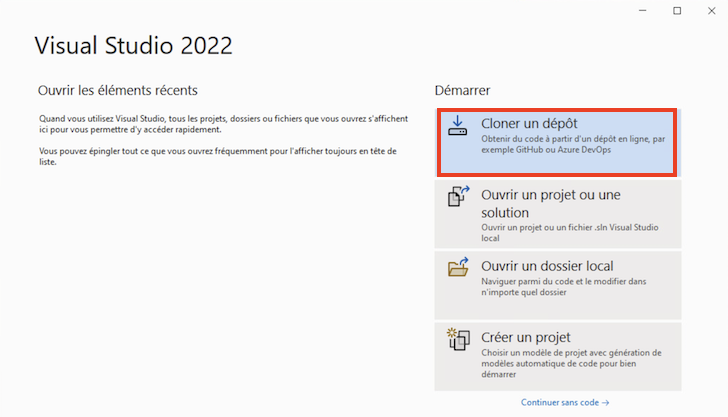

- Collez le lien de votre dépôt dans la zone de texte "URL du dépôt" et cliquez sur "Cloner" (si vous avez perdu le lien, vous pouvez le récupérer en retournant sur le site web de Git Hub et en sélectionnant votre dépôt)

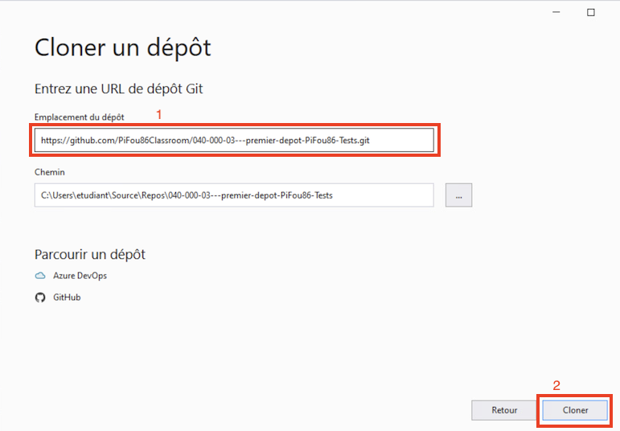

- La première fois que vous allez cloner un dépôt sur GitHub, Visual Studio va vous demander de vous identifier. Cliquez sur le bouton "Sign in with your browser"

- À partir de la page qui vient de s'ouvrir, cliquez sur le bouton "Authorize GitCredentialManager" qui va autoriser (déléguer) GitCredentialManager (logiciel installé sur votre ordinateur) à accéder à votre compte

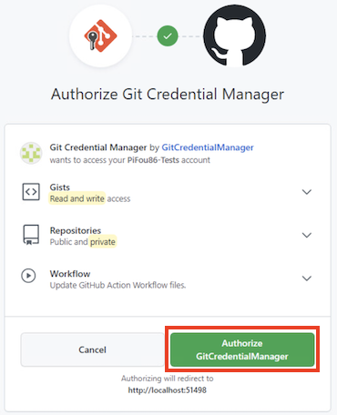

- La page suivante va s'afficher pour confirmer que tout s'est bien passé pour la délégation de droits

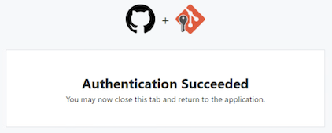

- Retournez sur le logiciel Visual Studio. À droite, vous devriez voir le dépôt que vous avez cloné :

- Faites un double clic sur le dossier affiché. Le contenu va s'afficher :

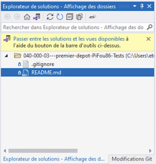

- Ouvrez le fichier "README.md" en double cliquant dessus

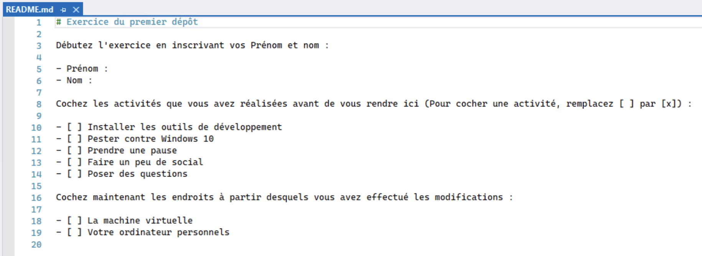

- Modifiez le contenu du fichier en suivant les instructions. Une fois modifié, vous allez enregistrer le fichier avec la combinaisons de touches "Ctrl + S". Vous allez pouvoir observer que le symbole de cadenas est enlevé et est remplacé par un symbole de rouge.

- Une fois les modifications réalisées cliquez sur l'onglet "Modifications Git" qui se trouve en bas en droite de l'écran.
- Entrez un commentaire de modification et cliquez sur "Valider tout et synchroniser"

- Une fois validée et synchronisée, un message va vous indiquer que ça s'est terminé avec succès

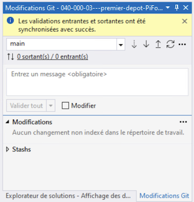

- Vous pouvez retourner sur GitHub, rafraichir la page et voir que vos modifications ont bien été enregistrées :

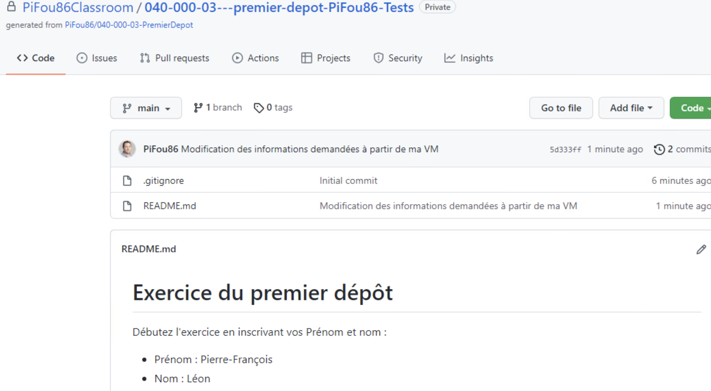

**Si vous êtes arrivé ici, bravo ! Vous avez fait votre première modification sur votre dépôt de travail !**

Sans le savoir vous avez réalisé plusieurs actions dans Git : clone, add, commit, pull, push qui seront détaillées durant votre parcours de formation.

## Exercice 3 - Ouvrir le travail dans Visual Studio - Machine personnelle

- Refaite les manipulations de l'exercice précédent à partir de votre ordinateur personnel en partant directement de l'étape de "Clonage du dépôt de travail" à "Synchronisation du dépôt de travail" : la modification du fichier README est de simplement cocher la case "Votre ordinateur personnel"

## Exercice 4 - Valider votre travail

- Rendez-vous sur le site web de GitHub et rendez-vous sur la page de votre dépôt de travail
- Rendez-vous sur l'onglet "Actions"

- Choisissez l'exécution la plus récente qui est représentée par la première ligne de la liste "x workflow runs". 
- Dans mon cas, la dernière exécution est en erreur. Allons voir ce qui c'est passé en cliquant sur cette ligne

- La tâche "Autograding" est en erreur. Vous pouvez voir ce qui a été fait en cliquant sur cette ligne

- Une des étapes de validation n'est pas passée. Ici on voit que je n'ai pas coché la case "Votre ordinateur personnel"

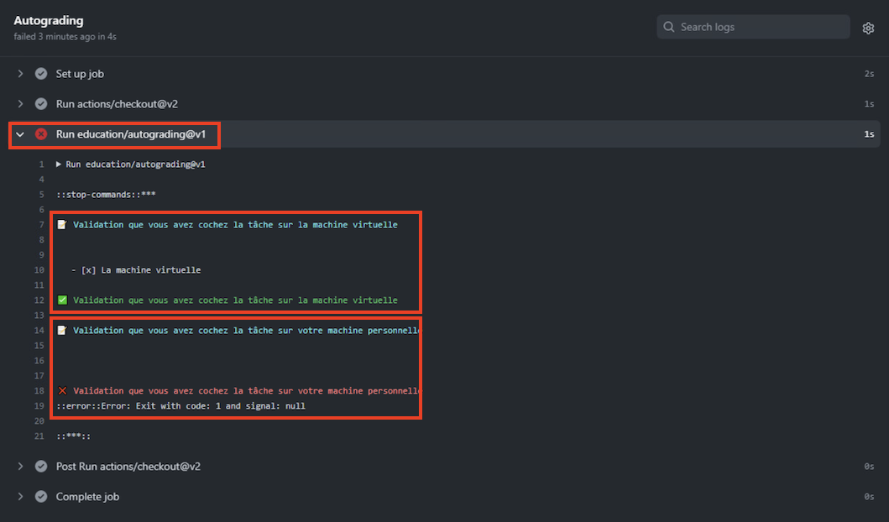

- Après avoir modifié le fichier README.md dans Visual Studio et avoir cliqué sur le bouton "Valider tout et synchroniser", le test passe dans mon cas.

- Comme précédemment, on peut regarder le détail en cliquant sur "Autograding"

- Vous pouvez voir que les différents tests validés en cliquant sur "Autograding"

**Si vous êtes arrivé ici, bravo ! Vous avez fait des modifications à votre travail et vous avez utilisé des tests automatisés afin d'effectuer une première validation sur votre travail ! Pour les autres validations n'oubliez pas d'impliquer votre enseignant !**

[Retour à la page principale](README.md)
